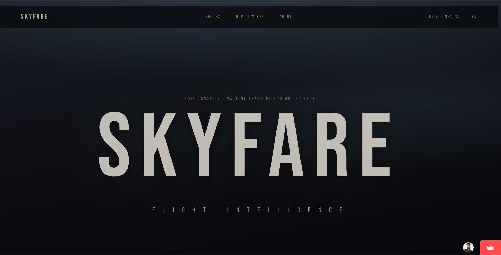
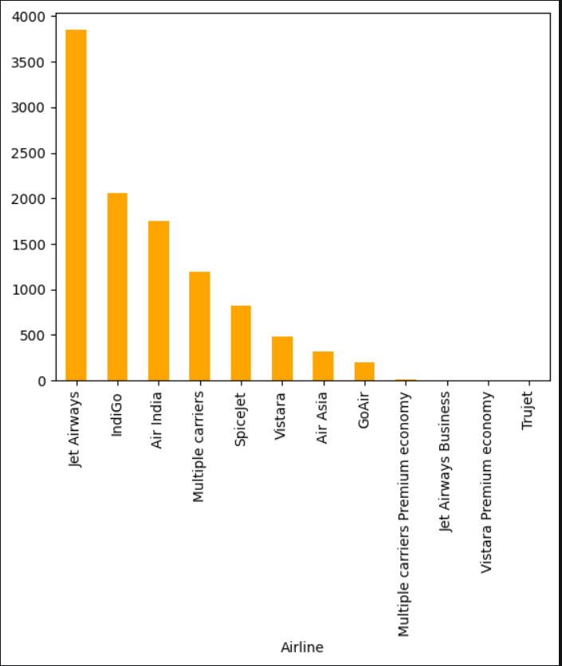
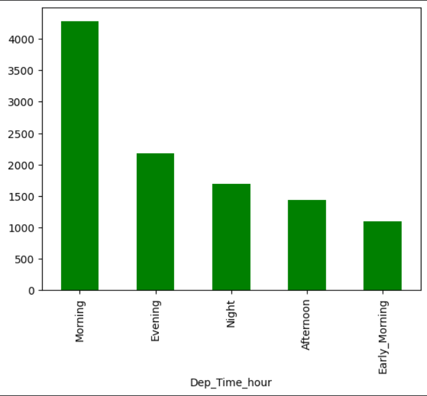

# SKYFARE -- Flight Price Intelligence

A machine learning web application that predicts domestic flight prices across India. Built with a Random Forest Regressor trained on 10,683 real flight records and served through a custom-styled Streamlit interface.

**Live Demo:** [skyfare-app.streamlit.app](https://skyfare-app.streamlit.app)



---

## Table of Contents

- [Overview](#overview)
- [Features](#features)
- [Project Structure](#project-structure)
- [Prerequisites](#prerequisites)
- [Installation](#installation)
- [Usage](#usage)
- [Machine Learning Pipeline](#machine-learning-pipeline)
- [Model Performance](#model-performance)
- [Dataset](#dataset)
- [Tech Stack](#tech-stack)
- [Author](#author)
- [License](#license)

---

## Overview

SKYFARE estimates domestic Indian flight ticket prices based on route, airline, schedule, and duration. Users input their travel parameters through a clean, editorial-style dark interface and receive an instant fare prediction powered by a trained Random Forest model.

The model achieves an R-squared score of 0.80 with a Mean Absolute Error of 1,171 INR on the test set.

---

## Features

- Predicts Indian domestic flight prices in INR across 12 airlines and 5 major metro routes
- Supports non-stop through 4-stop flight configurations
- Custom dark-themed UI with editorial typography (Bebas Neue, Barlow, Barlow Condensed)
- Glassmorphic navigation bar with backdrop blur effects
- Fully responsive layout for both desktop and mobile
- Input validation to prevent identical origin and destination selections
- Detailed result display including route summary, departure time, duration, and stop count

---

## Project Structure

```
skyfare/
├── .streamlit/
│   └── config.toml                 # Streamlit theme configuration
├── screenshots/
│   ├── hero_landing_page.png       # Application UI preview
│   ├── eda_airline_distribution.png    # Airline frequency chart from EDA
│   └── eda_departure_time_distribution.png # Departure time distribution chart from EDA
├── app.py                          # Main Streamlit web application (467 lines)
├── flight_price_prediction.ipynb   # Model training and exploratory data analysis notebook
├── flight_price_training_data.xlsx # Raw training dataset (10,683 flight records)
├── flight_price_model.pkl          # Serialized Random Forest model (~46 MB)
├── model_meta.json                 # Feature encodings, label mappings, and column metadata
├── requirements.txt                # Python dependencies
└── README.md
```

---

## Prerequisites

- Python 3.8 or higher
- pip (Python package manager)

---

## Installation

1. Clone the repository:

```bash
git clone https://github.com/your-username/skyfare.git
cd skyfare
```

2. Install dependencies:

```bash
pip install -r requirements.txt
```

3. Run the application:

```bash
streamlit run app.py
```

The app will open in your default browser at `http://localhost:8501`.

---

## Usage

1. Select your **departure city** and **destination** from the available Indian metro cities.
2. Choose your preferred **airline** and number of **stops**.
3. Set your **journey date**, **departure time**, and **arrival time**.
4. Enter the expected **flight duration** in hours and minutes.
5. Click **Calculate Fare** to receive an estimated ticket price.

The result panel displays the predicted fare in INR alongside a summary strip with route, timing, and stop details.

---

## Machine Learning Pipeline

### Exploratory Data Analysis

The training notebook includes detailed EDA. Below are two key distributions from the dataset:

**Flight count by airline** -- Jet Airways, IndiGo, and Air India dominate the dataset, while premium economy and business class entries are relatively rare.



**Flight count by departure time of day** -- Morning departures account for the largest share of flights, followed by evening and night slots.



### 1. Data Preprocessing

- Parsed `Date_of_Journey` into day and month features
- Extracted hour and minute components from `Dep_Time` and `Arrival_Time`
- Split `Duration` into separate hours and minutes columns
- Dropped low-signal columns: `Route`, `Additional_Info`, raw `Duration`, and `Journey_year`

### 2. Feature Engineering

- **Source cities**: One-hot encoded into binary columns (Bangalore, Delhi, Chennai, Mumbai, Kolkata)
- **Airline**: Label encoded using mean target price per airline (12 carriers)
- **Destination**: Label encoded using mean target price per destination (6 cities)
- **Total Stops**: Ordinally encoded (non-stop = 0 through 4 stops = 4)

### 3. Feature Selection

- Ranked features using `mutual_info_regression` from scikit-learn
- Top contributors: `Total_Stops`, `Duration_hours`, `Airline`, `Destination`
- Final feature vector: 16 dimensions

### 4. Model Training

- Algorithm: `RandomForestRegressor` (scikit-learn)
- Train/test split: 75% / 25% with `random_state=42`
- Outlier detection performed using the IQR method
- Model serialized with `joblib` for deployment

---

## Model Performance

| Metric            | Value     |
|-------------------|-----------|
| R-squared         | 0.80      |
| Mean Absolute Error | 1,171 INR |
| Training Samples  | 10,683    |
| Feature Count     | 16        |

---

## Dataset

The training data (`flight_price_training_data.xlsx`) contains domestic Indian flight records with the following columns:

| Column            | Description                          |
|-------------------|--------------------------------------|
| Airline           | Carrier name                         |
| Date_of_Journey   | Travel date                          |
| Source            | Departure city                       |
| Destination       | Arrival city                         |
| Route             | Flight route (dropped in training)   |
| Dep_Time          | Departure time                       |
| Arrival_Time      | Arrival time                         |
| Duration          | Total flight duration                |
| Total_Stops       | Number of intermediate stops         |
| Additional_Info   | Extra info (dropped in training)     |
| Price             | Ticket price in INR (target variable)|

### Supported Airlines

IndiGo, Air India, Jet Airways, SpiceJet, Vistara, Vistara Premium Economy, GoAir, Air Asia, Trujet, Multiple Carriers, Multiple Carriers Premium Economy, Jet Airways Business

### Supported Routes

- **Origins**: Bangalore, Delhi, Chennai, Mumbai, Kolkata
- **Destinations**: Delhi, Bangalore, Cochin, Kolkata, Hyderabad

---

## Tech Stack

| Layer               | Technology                              |
|---------------------|-----------------------------------------|
| Frontend            | Streamlit with custom CSS               |
| ML Model            | scikit-learn RandomForestRegressor      |
| Data Processing     | pandas, numpy                           |
| Model Serialization | joblib                                  |
| Visualization (EDA) | matplotlib, seaborn                     |
| Typography          | Bebas Neue, Barlow, Barlow Condensed    |
| Hosting             | Streamlit Community Cloud               |

---

## Author

Built by **Kshitish**

---

## License

This project is provided as-is for educational and demonstration purposes.
